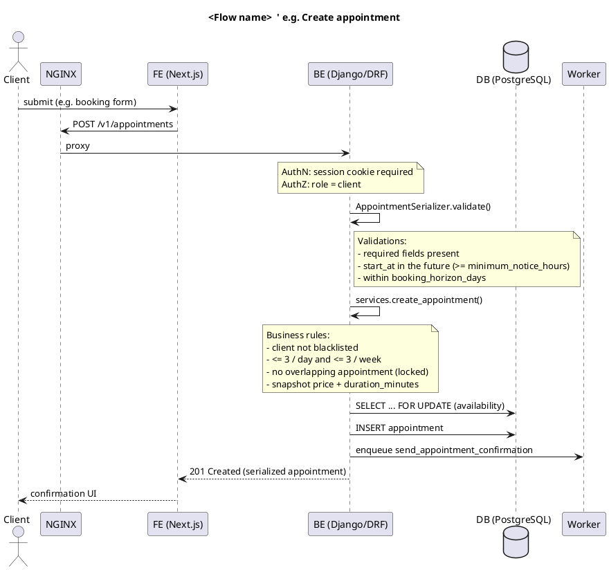

# FLOW DOCUMENTATION (PlantUML)

Whenever a **feature/flow is finished** (built, tested, merged), add or update a PlantUML sequence diagram documenting it, so any flow can be reviewed or refactored from a single source of truth.

## When & where

- **Trigger:** a feature/flow is complete — when its `docs/roadmap.md` task flips to `developed`, its flow doc must exist.
- **One file per flow:** `docs/flows/<flow-name>.puml` (kebab-case, e.g. `create-appointment.puml`, `cancel-appointment.puml`, `join-waitlist.puml`).
- **Keep it in sync:** update the existing `.puml` when the flow changes — never let it drift from the code.

## Participants (architecture components)

Model the flow across these components, in order:

- `Client` — the person/browser.
- `NGINX` — reverse proxy / TLS.
- `FE` — the relevant frontend (client app or back office, Next.js).
- `BE` — the Django/DRF backend.
- `DB` — PostgreSQL.

Add extra participants **only when the flow uses them:** `Worker` (Procrastinate), or an external system (`Twilio`, `Email`, `Google Calendar`).

## What to document

Keep it high-level — enough to review/refactor, not a code dump.

- **Direction:** the ordered calls between components (request path + response), including the route (`/v1/...` for the client app, `/bo/v1/...` for the BO).
- **Key classes/methods:** name the meaningful ones touched — serializer, `services.<fn>`, `selectors.<fn>`, `models`, `tasks.<fn>` — without expanding them exhaustively.
- **Business rules & validations:** attach a `note` at the step where each is enforced (authN/authZ, field validation, invariants, limits, transactions/locks, price snapshot).
  These are the "things for the dev to check" on review and mirror `business-rules.md`.

## Conventions

- Use sequence diagrams (`@startuml ... @enduml`) with a `title`.
- Put validations/rules in `note` blocks on the participant that enforces them.
- Reference the source of truth, don't duplicate logic: rules live in `business-rules.md`; the diagram shows *where* they apply.
- The `plantuml-flow-docs` skill can help generate/extend these.

## Template

Copy `docs/flows/_template.puml` for each new flow. For reference:

